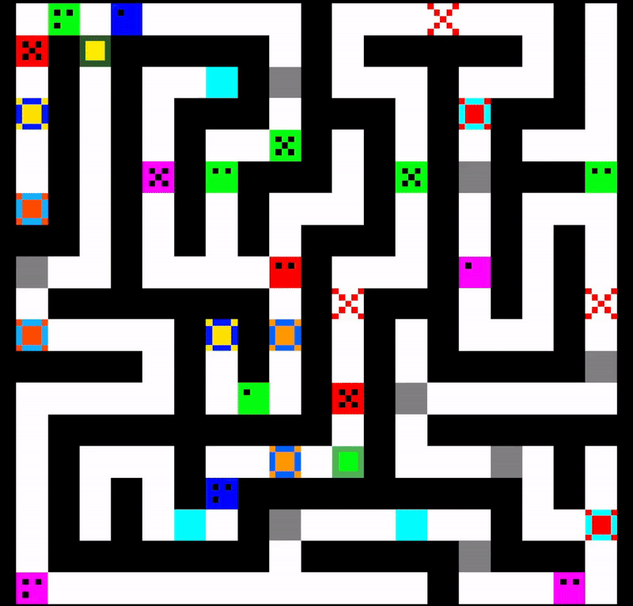

# MPS Maze Project
Enunțul acestui proiect se poate găsi [aici](https://ocw.cs.pub.ro/courses/mps/proiect?rev=1732091997).

## Demo

## Structura echipei
* Project Manager:
    - Ionela-Cristina Strîmbeanu 342C1

* Team Leader:
    - Mihai-Lucian Pandelica 342C1

* Software Developer:
    - Cristian-Alexandru Chiriac 342C1

    - Alexandru-Constantin Munteanu 342C1

* Tester:
    - Preda Diana 344C1

## Tehnologii Utilizate
* Limbaj de Programare: Python
* Framework: Flask, Tkinter
* Version Control: Git

## Metodologie de Dezvoltare
* Proiectul urmează metodologia Agile, cu o adaptare specifică la nevoile echipei:
    - Sync-uri regulate:
        + Echipa se întâlnește de două ori pe săptămână, Luni și Joi, iar fiecare sync include:
        + Sprint Review și Sprint Retrospective: La începutul fiecărui sync, echipa analizează progresul realizat,
        discută ce a funcționat bine, ce poate fi îmbunătățit și soluțiile pentru eventualele probleme întâmpinate.
        + Sprint Planning: După revizuirea sprintului anterior, se planifică activitățile pentru următoarele zile,
        stabilindu-se prioritățile și alocarea task-urilor fiecărui membru.

## Cronologie Implementare:
1. Etapa de Inițiere:
    * Crearea repository-ului Git și structurarea proiectului (clase utilizate în componente multiple).
    * Dezvoltarea generatorului de maze și testarea inițială.
2. Etapa de Dezvoltare:
    * Implementarea infrastructurii serverului și a viewerului și conectarea acestora.
    * Dezvoltarea modului friendly al serverului.
    * Generarea și poziționarea capcanelor.
    * Regândirea și refacerea viewer-ului.
    * Implementarea mecanismelor de teleportare prin portaluri și evitarea ciclurilor infinite.
    * Dezvoltarea logicii AI-ului agentului.
3. Etapa Finală:
    * Dezvoltarea modului Mod2 al viewer-ului pentru afișarea view-urilor agentului.
    * Integrarea funcționalităților finale: fog, tower, x-ray points și modul Await for Input.
    * Revizuirea și completarea documentației.

Pentru o descriere mai detaliată a cronologiei proiectului, precum și a flow-ului de lucru, puteți vedea și 
[Meeting Notes](https://docs.google.com/document/d/1olysrDAAVpFEdd3jGwfWdTUvaW2wc1GH/edit?usp=sharing&ouid=101967091967154259676&rtpof=true&sd=true)

## Scurt Istoric Commit-uri Git
- 03 Nov: Infrastructură de bază: clase effects.py, game_elements.py, tile.py.
- 07 Nov: Adăugare "code" în tile.py și implementare salvare/încărcare hărți.
- 11 Nov: Corecții reguli acoperire maze.
- 13 Nov: Creare server.
- 22-23 Nov: Viewer conectat la server, timeout server.
- 27 Nov: Implementare agent și mod friendly.
- Decembrie: Implementări finale: portaluri, capcane, noi funcționalități în viewer.

## Rulare proiect:
1. Instalare dependente
    pip install -r requirements.txt
2. Pornire server - Există doua metode de a porni serverul:
    * Pe un labirint generat random la pornire serverului:
        python3 app.py
    * Pe un labirint deja generat, regasit sub forma unui fisier .png (De exemplu maze.png)
        python3 app.py -m maze.png
3. Pornire agent
    python3 agentV2.py 127.0.0.1 5000

Viewer-ul este pornit automat de către server, astfel că nu este necesar să fie lansat separat. 
Pentru modului de ceață (fog), se adaugă opțiunea -f la pornirea serverului.

## Funcționalități cheie:
* Labirintul este generat astfel încât să respecte regula de 50% acoperire
* Capcanele, portalurile și puntele X-RAY sunt funcționale și cauzează comportamentul așteptat
* Viewerul afișeaza labirintul în timp real, afișând traseul agentului pe măsură ce acesta se deplasează.
* Funcționalitățile de Zoom, Scroll și Fog pentru Viewer sunt implementate
* Serverul funcționează atât în modul friendly, cât și unfriendly
* Agentul găsește ieșirea din labirint atunci când ea este accesibilă
* Agentul funcționează corect atât în modul "real time", cât și în modul "await for input"

Pentru o descriere detaliată a bug-urilor găsite în urma testării, precum și a soluțiilor găsite, puteți vedea și 
[Testing Report](https://docs.google.com/document/d/1O6vdaRGt1Qyubcg6SIUwwBSMXlXDmeCR/edit?usp=sharing&ouid=101967091967154259676&rtpof=true&sd=true)
